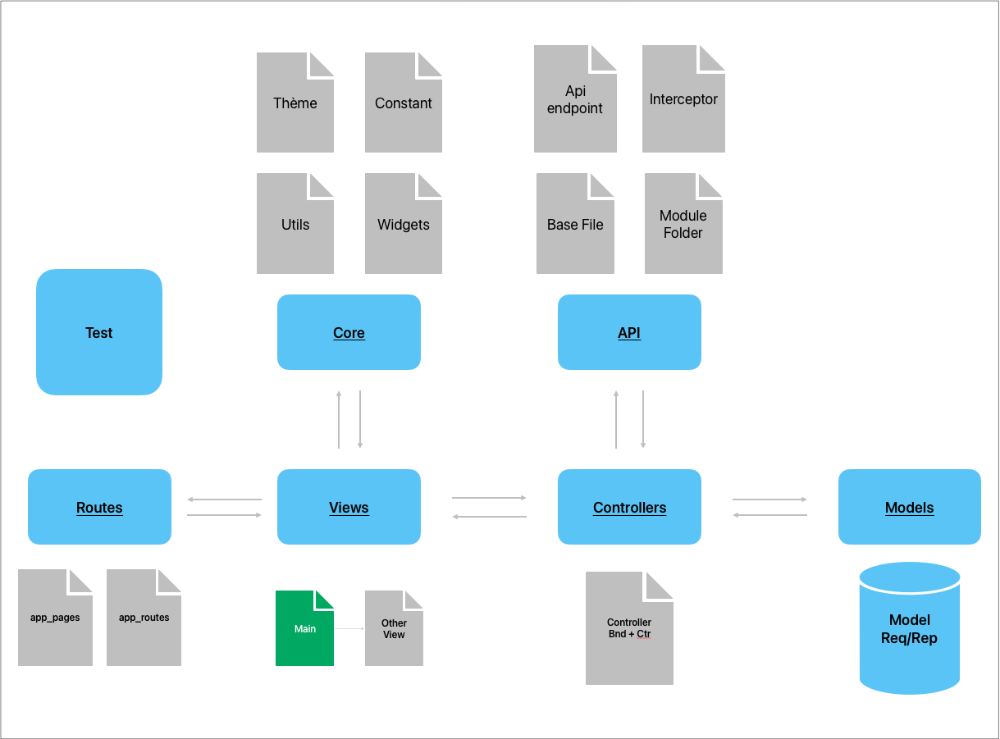
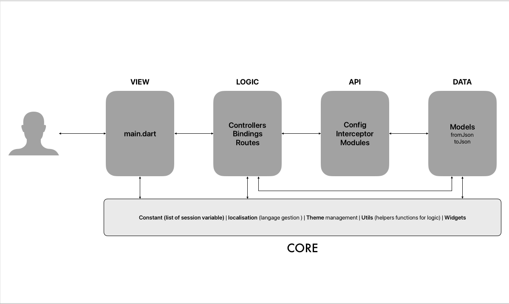

# Flutter-GetX-Boilerplate

A Flutter Clean Architecture Using [GetX](https://github.com/jonataslaw/getx).

## Architecture



## Flux de données



## Project Structure

```
|-- lib
    |-- main.dart
    |-- api
    |-- controllers
    |-- core
    |-- Models
    |-- routes
    |-- src
    |-- views
```

### `api/`

Couche réseau basée sur **GetConnect**.

| Fichier / Dossier | Rôle |
|---|---|
| `config/base.dart` | `BaseProvider` — configure `baseUrl`, timeout et attache les intercepteurs à chaque requête |
| `config/api_endpoints.dart` | Centralise toutes les URLs (`baseUrl`, `etc...`) |
| `interceptor/request_interceptor.dart` | Injecte le token Bearer et l'en-tête `X-Requested-With` avant chaque requête |
| `interceptor/response_interceptor.dart` | Traite et journalise les réponses HTTP |
| `modules/` | expose les fonctions pour les appels API et retourne les résultats en fonction des models correspondants |

---

### `controllers/`

Logique métier GetX (un controller + un binding par feature).

| Dossier | Fonctions clés |
|---|---|
| `auth/` | `AuthController.login()` — valide le formulaire, appelle l'API, stocke le token et redirige vers la page adéquate |
| `splash/` | `SplashController` — vérifie l'état de session au démarrage et redirige vers la page adéquate |

> Chaque dossier contient un **Binding** (`binding_*.dart`) qui injecte le controller via `Get.lazyPut`.

---

### `core/`

Utilitaires et ressources partagés à travers toute l'application.

| Sous-dossier | Contenu |
|---|---|
| `constants/` | `AppConstant` (config globale), `ColorConstant` (palette), `SessionKeys` (clés GetStorage) |
| `localization/` | `AppLocalization` + traductions FR / EN / etc... |
| `theme/` | `AppTheme`, `AppTextStyles`, `ThemeConstants` |
| `utils/` | `AppSession` (gestion token/session), `Validator`, `Helpers`, `SizeUtils`, `CustomLog` |
| `widgets/` | Composants réutilisables : `CustomButton`, `CustomTextFormField`, `Loader`, `Snackbar`, widgets de formulaire… |

---

### `Models/`

Modèles de données sérialisables (JSON).

| Dossier | Contenu |
|---|---|
| `0x/` | `ErrorResponse` (format erreur API), `SelectionPopupModel` (item de liste déroulante) |
| `auth/` | `AuthRequest` (corps de requête login/register), `UserModel` (réponse utilisateur, avec `req_auth.g.dart` généré par `build_runner`) |

---

### `routes/`

Définition de la navigation GetX.

| Fichier | Rôle |
|---|---|
| `app_routes.dart` | Constantes de routes (`Routes.splash`, `Routes.auth`, `Routes.profile`) |
| `app_pages.dart` | `AppPages.routes` — associe chaque route à sa page et à son binding |

---

### `src/`

| Fichier | Rôle |
|---|---|
| `exports.dart_exporter.dart` | Barrel file **auto-généré** — centralise tous les exports du projet pour éviter les imports répétitifs |

---

### `views/`

Couche présentation (UI uniquement, sans logique métier).

| Fichier | Écran |
|---|---|
| `splash.dart` | Écran de démarrage avec vérification de session |
| `auth/auth.dart` | Formulaire de connexion |

## Features

- Integrating Unit Test (To-do).
- Models management
- Create an easy to use API provider with [GetConnect](https://github.com/jonataslaw/getx#getconnect).

### [Sovmulax](https://github.com/sovmulax)

### Description
